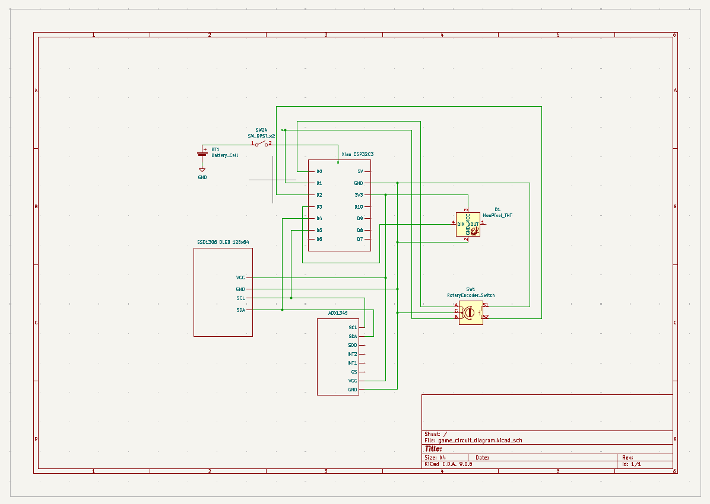
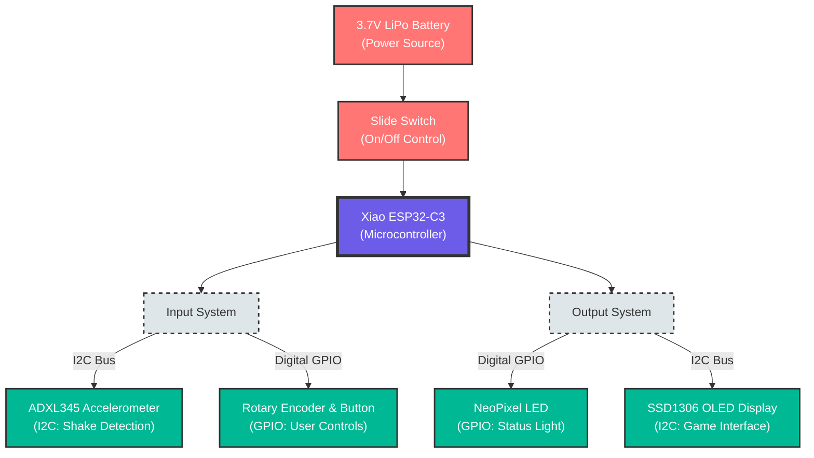

# Reactor Core: A 90s-Style Handheld Reflex Game ☢️

Reactor Core is an embedded electronic handheld game inspired by 90s classics like Bop-It and Brain Warp. Built as a final project for [Insert Class Name], this device challenges players to stabilize a volatile nuclear reactor by physically manipulating the device in response to rapid-fire commands.

*(A photo of the finished device.)*

---

## 🎮 How to Play

The goal is simple: keep the reactor stable. The screen will display a command, and you must perform the action within the time limit.

### The 4 Moves

- `VENT` – Press the rotary encoder button down.  
- `QUAKE` – Shake the entire device (accelerometer input).  
- `LEFT` – Twist the knob counter-clockwise.  
- `RIGHT` – Twist the knob clockwise.  

### Progression

- 3 Difficulty Modes: Easy (3s), Medium (2s), Hard (1s)  
- 10 Levels: The game speeds up as you progress through 10 stages  
- Win Condition: Survive all 10 levels to stabilize the core  
- Lose Condition: Wrong move or running out of time results in a meltdown (Game Over)

---

## 🛠️ Hardware Bill of Materials (BOM)

| Component            | Quantity | Description                         |
|----------------------|----------|-------------------------------------|
| Seeed Xiao ESP32C3   | 1        | The brain of the project (MCU)      |
| SSD1306 OLED         | 1        | 0.96" 128x64 I²C display            |
| ADXL345              | 1        | 3-axis accelerometer (shake input)  |
| Rotary Encoder       | 1        | EC11 type with push button          |
| NeoPixel LED         | 1        | WS2812B (visual status indicator)   |
| LiPo Battery         | 1        | 3.7V lithium polymer battery        |
| Slide Switch         | 1        | SPDT power switch                   |
| Perfboard            | 1        | GIX proto-board (purple)           |
| Enclosure            | 1        | Custom 3D printed PLA case          |

---

## 🔌 Circuit Diagram & Wiring

The system uses CircuitPython. Below is the wiring map for the Xiao ESP32C3.

| Component Pin | Xiao Pin | Function                 |
|---------------|----------|--------------------------|
| OLED SDA      | D4       | I²C data                 |
| OLED SCL      | D5       | I²C clock                |
| Accel SDA     | D4       | I²C data (shared)        |
| Accel SCL     | D5       | I²C clock (shared)       |
| Encoder Pin A | D0       | Clockwise signal         |
| Encoder Pin B | D1       | Counter-clockwise signal |
| Encoder Switch| D2       | Button press             |
| NeoPixel Data | D3       | LED signal               |
| Battery (+)   | BAT+     | Via slide switch         |



---

## 💻 Software & Installation

This project runs on CircuitPython 8.x (or newer).

### Prerequisites

1. Download the standard CircuitPython `.UF2` for Xiao ESP32C3:  
   https://circuitpython.org/board/seeed_xiao_esp32c3/
2. Put the Xiao into bootloader mode and drag the `.UF2` file onto the `XIAO-SENSE` drive.

### Required Libraries

Upload the following from the Adafruit CircuitPython Bundle to the `lib` folder on your `CIRCUITPY` drive:

- `adafruit_ssd1306.mpy` (display)  
- `adafruit_adxl34x.mpy` (accelerometer)  
- `neopixel.mpy` (LEDs)  
- `simpleio.mpy` (tone/beeps – optional)  
- `adafruit_framebuf.mpy` (display dependency)

### Installation Steps

1. Clone this repository.  
2. Copy the contents of the `code/` folder (including `code.py` and the `lib/` folder) to the root of your `CIRCUITPY` drive.  
3. The board will reset and the game menu should appear on the OLED.

---

## 📂 Project Structure

```
.
├── Documentation/
│   ├── game_circuit_diagram.kicad_sch   # Hardware Schematic (KiCad)
|   └── system_diagram.png               # System Diagram
├── src/
│   ├── main.py                          # Main Game Logic (The Reactor Core)
│   └── rotary_encoder.py                # Custom Driver for the Encoder
├── .gitignore                           # Git configuration
└── README.md                            # Project Documentation
```

---

## 🧠 System Architecture



The code is structured as a finite state machine (FSM):

- `STATE_CALIBRATE`: Reads the accelerometer at rest to determine the “zero” point.  
- `STATE_MENU`: Waits for the user to select Easy/Medium/Hard using the knob.  
- `STATE_GAME_LOOP`:
  - Generates random command  
  - Starts timer  
  - Polls sensors (encoder position and accelerometer magnitude)  
  - Checks for success/fail  
- `STATE_GAMEOVER`: Displays score and waits for reset.  
- `STATE_WIN`: Displays victory animation.

---

## 🖨️ Enclosure Design

The case was designed in [Fusion 360 / Tinkercad] to resemble an industrial handheld remote.

- Material: PLA  
- Layer Height: 0.2 mm  
- Supports: Required for the USB port opening  

---

## 👥 Credits

- **Author:** Wei Chang
- **Course:** Sensors and Circuits (Fall 2025)  
- **School:** University of Washington GIX

> Disclaimer: No actual nuclear reactors were harmed in the making of this game.

